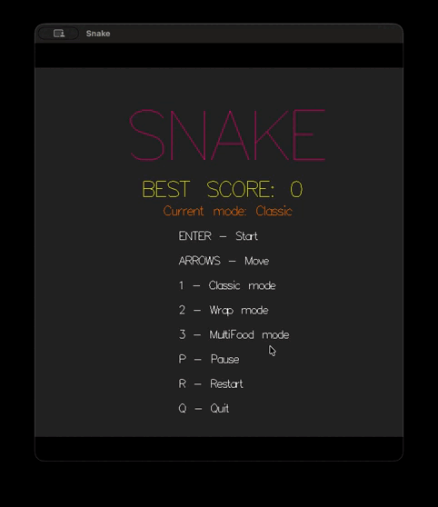

# Snake Game

Реализация игры "Змейка" на Haskell с рендерингом через Gloss для Практикума ВМК МГУ 2026.



## Возможности

- Три режима игры: `Classic`, `Wrap` и `MultiFood`
- Подсчёт текущего счёта и отображение общего рекорда 
- Сохранение рекорда между запусками
- Пауза и быстрый рестарт
- Экран меню и экран окончания игры
- Механика яблочек: рост змейки, ускорение игры и начисление очков

## Режимы игры

- `Classic` — классическая змейка, столкновение со стеной завершает игру
- `Wrap` — переход через границы поля на противоположную сторону
- `MultiFood` — режим `Classic` с несколькими объектами еды

## Управление

- `Enter` — начать игру из меню
- `1` — выбрать режим `Classic`
- `2` — выбрать режим `Wrap`
- `3` — выбрать режим `MultiFood`
- `Стрелки` — управление движением
- `P` — пауза
- `R` — рестарт
- `Esc` — выход в меню
- `Q` — выход из игры

## Требования

- Установленный [Stack](https://www.haskellstack.org/)
- Графическое окружение с поддержкой OpenGL (для библиотеки `gloss`)

## Сборка и запуск

```bash
stack setup
stack build
stack run
```

## Хранение данных

- Рекорд хранится в файле `data/best_score.txt`
- Если файл отсутствует или повреждён, при запуске используется значение `0`

## Структура проекта

- `src/` — библиотечная часть: логика игры, рендеринг, типы, обработка ввода
- `app/` — исполняемый модуль (точка входа)
- `test/` — автоматические тесты проекта
- `data/` — данные игры (например, файл с рекордом)
- `stack.yaml` — версия компилятора и зависимости
- `package.yaml` — описание проекта, зависимости и опции компиляции
- `README.md` — описание проекта и инструкции по сборке и запуску

## Дополнительно

- `.gitignore` — список файлов и директорий, игнорируемых Git
- `.stack-work/` — служебная директория Stack (не включается в репозиторий)

